# Documentación ML dungeon
**Tabla de contenido**
- [Introducción y Metas](#introducción-y-metas)
  - [IA en los videojuegos](#ia-en-los-videojuegos)
  - [Aprendizaje Reforzado](#aprendizaje-reforzado)
  - [Unity](#unity)
  - [Metas](#metas)
- [Creación del juego](#creación-del-juego)
  - [Base del juego](#base-del-juego)
  - [Implementación de Redes Neuronales](#implementación-de-redes-neuronales)
## Introducción y Metas
La intención de este proyecto es el conseguir un entendimiento de tanto el Software de desarrollo de videojuegos "Unity" y de su paquete de Agentes de aprendizaje automátizado "ML Agents", el cuál es potenciado por Python y Tensorflow. Esto con el fín de expandir este uso a productos tanto como en el campo de los videojuegos, como la simulación.

### IA en los videojuegos
- El desarrollo de la inteligencia artificial en los videojuegos existe casi desde la incepción de Este.

- Hay exponentes modernos del buen uso de la inteligencia artifical, como el mal uso

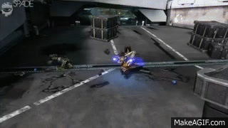
- cuando se usa correctamente, puede ayudar a que la experiencia de juego sea más memorable
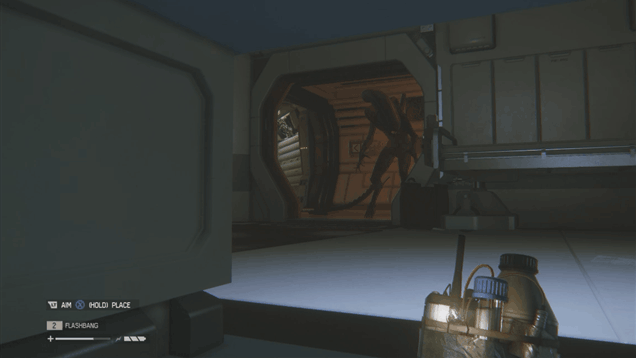
- También puede contribuir a la mala acogida de un título
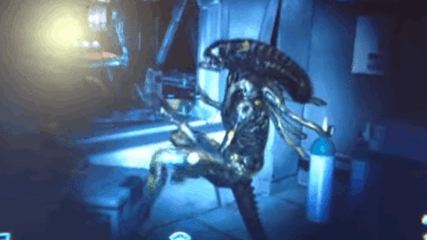
- O puede ser el resultado de métodos no muy bien percibidos(Cheating-AI)
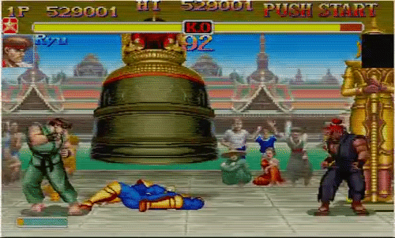
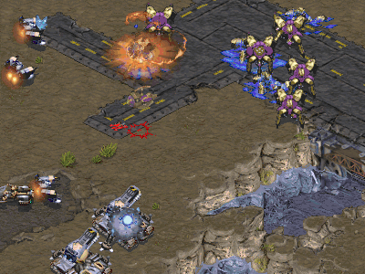

- El estándar del la inteligencia artifical ahora es el que todo Sea "Hard coded".
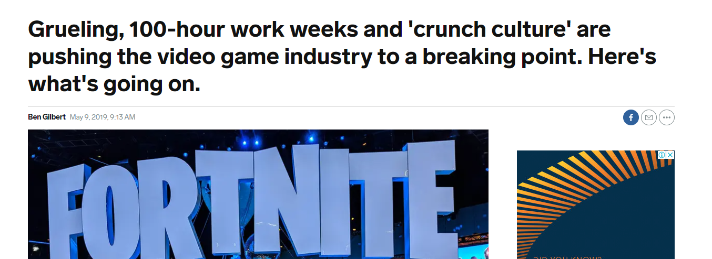

- Con las tecnicas mostradas aquí, es posible conseguir Inteligencia artificial con buenas respuestas, y con menos esfuerzo por parte del programador.

### Aprendizaje reforzado
#### Breve explicación
- Al agente se le asigna un sistema de recompensas y es trabajo de este experimentar y maximimizar sus recompensas.
- El aprendizaje reforzado tiene un talón de aquiles: **El problema de recompensas escasas/sparce rewards** 
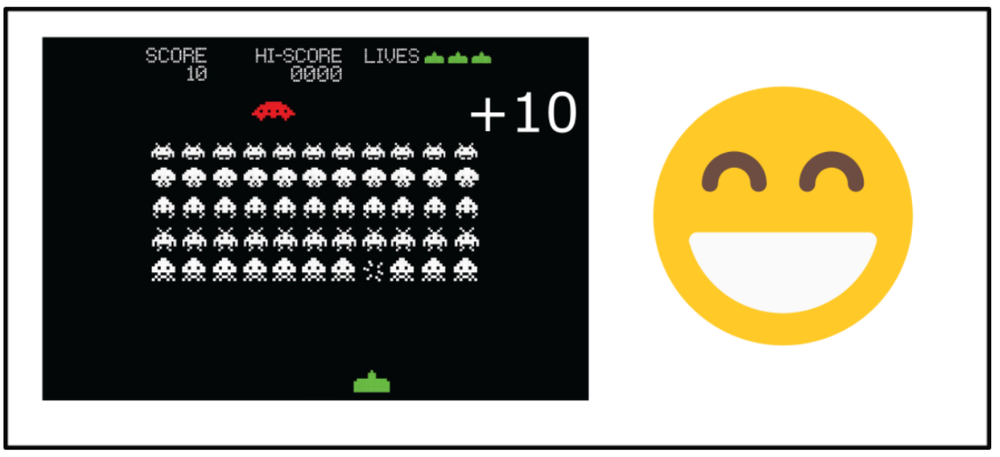
#### Exploración por curiosidad

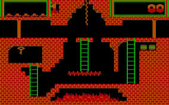

- Es posible hacer aprendizaje reforzado incluso sin que el programador asigne recompensas extrinsicas
- Se aplica una segunda red neuronal que hace predicciones con base en lo hecho por el mismo agente.

### Unity
#### Introducción al software
- Motor de videojuegos sacado en 2005 exclusivo para Machintosh. ahora disponible de múltiples plataformas
- Altamente usado tanto por desarrolladores independientes, empresas pequeñas y grandes compañias
- Tiene versión gratis y distintos modelos de suscripción
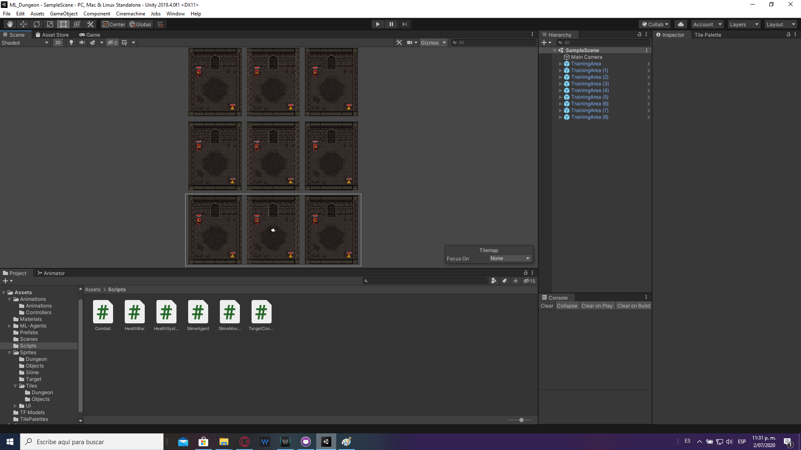

#### Introducción al paquete ML Agents
- **Unity Machine Learning Agents Toolkit**
- En desarrollo desde 2017. Salida oficial en abril del 2020
- Herramienta para el desarrollo de agentes inteligentes para videojuegos y simulación
- Basado en tensorflow
- Usa archivos YAML para la creación de las redes
### Metas
Lo que se quiere lograr en este proyecto:
- Diseñar un terreno de aprendizaje
  - Diseñar uno o más terrenos para el agente haga su entrenamiento
  - Diseñar un agente Enemigo con un sistema de vida, control de ataque y movimiento
  - Diseñar un objetivo con control de vida y ataque.
- El entrenamiento del agente Enemigo
  - Lograr que el agente busque un objetivo y le haga daño
  - Lograr que el agente huya del objetivo en caso de que se encuentre en baja vida

## Creación del juego

### Base del Juego
#### Terreno de entrenamiento:
  - Uso de Baldosas para armar el campo
  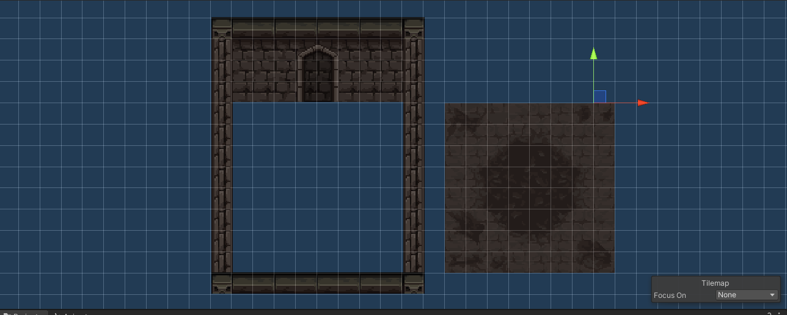
  - Implementación de múltiples capas para hacer límites de juego
  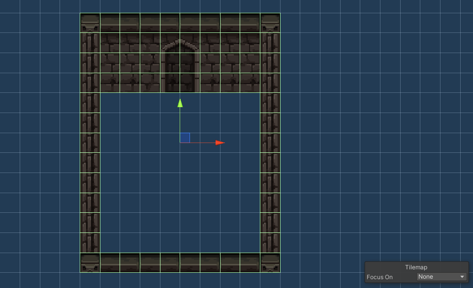
  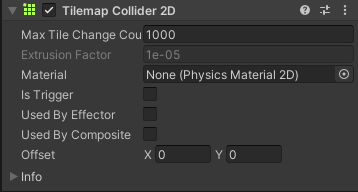
#### Creación del agente:
  - Uso de animación en sprites
  
  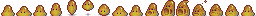
  
  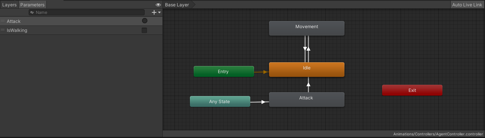
  
  - Sistema de Combate y movimiento

### Implementación de Redes Neuronales
#### Estados de aprendizaje:
  - Initialize
  - Episode Begin
  - Collect Observations
  - Action Received
    - Refuerzos Positivos
    - Refuerzos Negativos
  - Heuristic
  

## Evaluación
- Demostración
